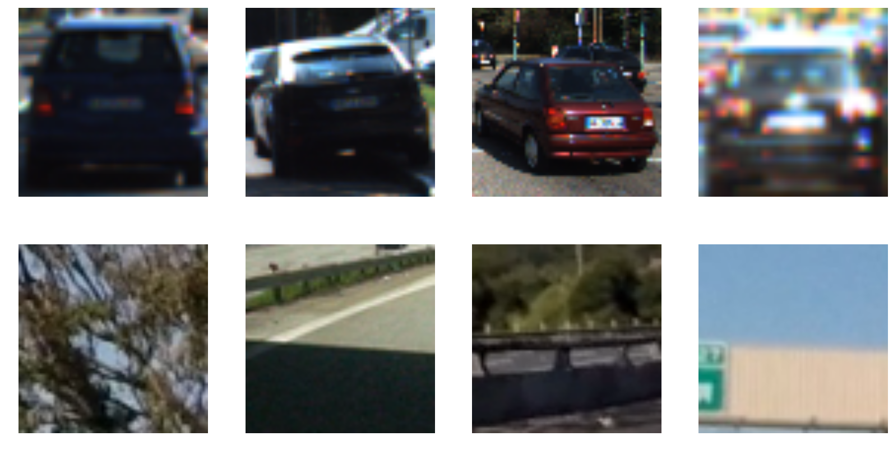
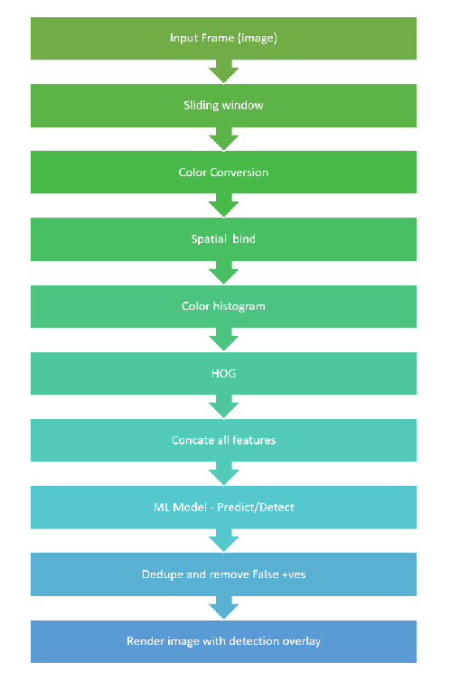
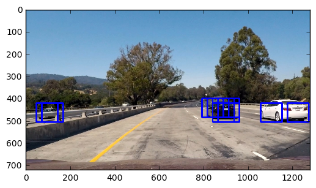
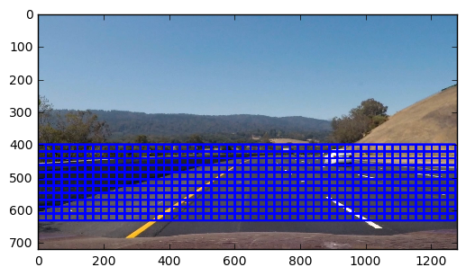
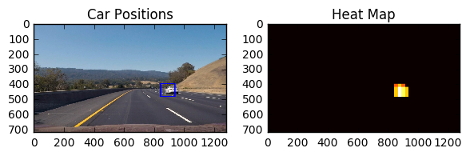
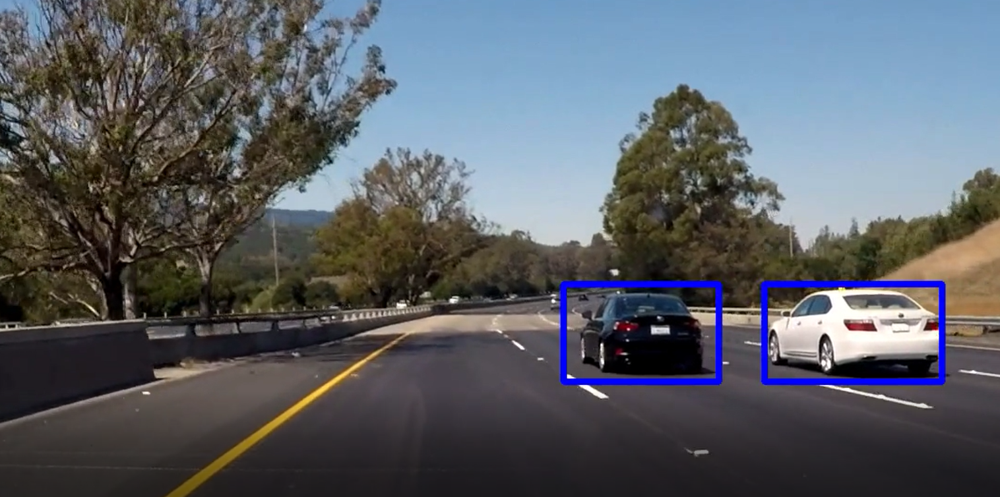

### Vehicle Detection and Tracking

The goals project is to detect vehicles on a video frame using computer vision and machine learning methodology. Techniques used for classification was LinearSVC model and for feature extraction a combination of HOG technique, color histogram, spatial bindings.

Using sliding window technique, I extracted imaged patches from the frames. These windows were then passed for feature extraction. The generated features were used as the input for the LinearSVC model. The output of the SVM model indicates whether the given window is a vehicle or not. The result was further processed by removing duplicate detections and false positives, bounding boxes were drawn to indicate vehicles.

### Main Code and Output:

##### The code for this project is in the [vehicle_detection_training.ipynb](./vehicle_detection_training.ipynb)
##### Output Video:  [link to my video result](./vehicle_detection.mp4)
##### Each section is marked with the functionality they perform and those code snippets on jupyter notebook are listed under the same name as here.

### Data set exploratory Images

For this project, I was provided with a labeled dataset of vehicle and non-vehicle examples to train my classifier. These example images come from a combination of the GTI vehicle image database, the KITTI vision benchmark suite, and examples extracted from the project video itself. There set was almost evenly balanced between cars and non-cars. The images were provided as .png files.

Total number of images labeled as Cars: 8792

Total number of images labeled as Non-Cars: 8968

Here are some sample images:

I used the _glob_ module to import images into my workspace. Code for this can be found under the &quot;Exploratory data analysis and Loading the data&quot; section

### High Level Pipeline overview
Here is a high level over view of the pipeline before we start going into sections. Code for pipeline is under section "Pipeline".

### Sliding Windows

The  detection pipeline starts with the sliding window technique, where we scan a small window over the image area to extract image patches and then slide over the image to next location with some overlap between windows. Code snippet from the class and quiz was used and refactoredd for the project. Work involved play with some window sized and overlap ration.
Since we focus only on the road area (i.e.) vehicle path, sliding window was focused only to y\_axis at with min,max at [400,600].
Other parameter reading where : xy\_window = (96, 96) and xy\_overlap = (0.75, 0.75)
Code for this section is under "Feature Extractions and Sliding window"

Following image shows the locations of the search windows used by our detection system.

Sample:

### **Feature Extraction**

For the HOG feature extraction I started trying out RGB, Gray, HLS color spaces to get better gradients and finally got better results with YCrCb and LUV was also better. I also played by visualizing images with different HOG params settings namely the orienatations, pixels per cell and the cell per blocks. Code block &quot;Training and Tweaks&quot; has the parameter values for HOG and implementation can be found &quot; Feature Extractions and Sliding window&quot;

orient = 9  # HOG orientations

pix\_per\_cell = 8 # HOG pixels per cell

cell\_per\_block = 2 # HOG cells per block

hog\_channel = &#39;ALL&#39; # Can be 0, 1, 2, or &quot;ALL&quot;

### Training the Machine Learning Model

Data was divided into Training and test set. 20% of the data was used for testing. Data was split and shuffled using the sklearn.model\_selection packages module train\_test\_split. Training data was mixed with Car and non-car images and their respective labels (features). 

For faster classification and more accurate prediction LinearSVC was selected for this project. (Good inputs from the class as well on this model). Code for the training can be found under &quot;Training and Tweaks&quot;

Test accuracy results are listed here:

Feature vector length: 8460

7.79 Seconds to train SVC...

Test Accuracy of SVC =  0.9901

For the ML and proper detection (tested against a cut sample video), following hyper parameters were tweaked to get best results: Code under &quot;Training and Tweaks&quot;

color\_space was set to &#39;YCrCb&#39; # others RGB, HSV, LUV, HLS, YUV

Hog orientations at 9  # HOG orientations

HOG pixels per cell was set at 8

HOG cells per block

hog\_channel was used as  &#39;ALL&#39;

spatial\_size was set at (32, 32) # Spatial binning dimensions

Number of histogram bins was 32

### Handling False Positives and Multiple Detectors

To make the detection robust and avoid notice, we need to handle false postives and deplicate detections. Heats maps and scipy.ndimage.measurements packages 'label' module was used. Code for this section is under "Multiple Detections & False Positives".
This requires initializing zero numpy array of dimension of the input images.Add a value of 1 for all pixels inside very detected window by the model. 
Using a threshold value the hot parts are detect as cars and rest ignored. On the video frame, to get more robust and smooth results a dequeue of heatmaps from frames was created (upto 10) and then summed up and subject to thresholding. This proved effective in giving a smooth and more robust detection. A simple getallhm() method was implemented on the "pipeline" section for this.

 

## Conclusions and Future Improvements

This is a great project to understand and explore vehicle detection using computer vision and machine learning. HOG feature and reference videos were very advanced methods that will come in handy for mu future works and projects. Some of the challenges on project was finding the right window sizing, color transformation selection, heatmap thresholding. It took serveral rounds of trail and adjustments to get to a resonable output and detection. I also observed that Hog feature is very powerful with right amount parameters tuning, it by itself can provide great detection and tracking. 

However, some of the improvements that needs to go into this include increase in performance and more work on thresholding to get smoother and robust detection. I plan to improve this model to detect and track better:
      increase traning set, augmenting the images with shear, transformations, etc. 

      harder false positives weeding
      
      try other machine larning models and also deep learning (NN)
      
      work more on feature selection tuning.

Once the above plan is acheived try this one challenge videos provided by udacity for advanced lane finding projects. It will also be interesting to train this model to work on city streets where the objects are more than just vehicles such as people, bikes, signs etc.

##### Output Video:  [link to my video result](./vehicle_detection.mp4)

